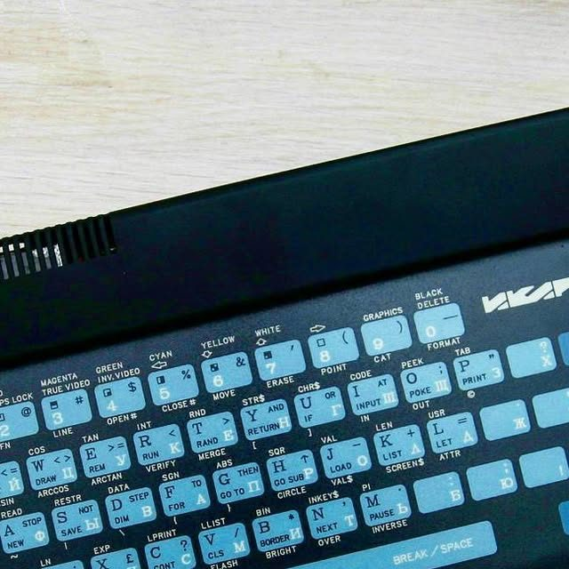

---
# ── Метадані ──────────────────────────────────────────────────────
# EN-переклад. Тіло — англійською; спільні поля збігаються з UA-версією
# (src/content/longreads/ikar-64-kharkiv-clone.md). Парування UA↔EN —
# за спільним slug (див. src/lib/longreads.ts).
slug: "ikar-64-kharkiv-clone"
block: "Б"
card_id: "Б2"
title:
  uk: "Ікар-64: харківський клон Spectrum із колекції музею"
  en: "The Ikar-64: a Kharkiv-made Spectrum clone from the museum’s collection"
lead:
  uk: "На старті ця машина показувала «**** IKAR-64 ****». Її зібрали 1991 року в Харкові на «Хартроні» — на розсипу логіки, у металевому корпусі. Розповідаємо про український клон Spectrum із нашої колекції та його сусідів по країні."
  en: "On power-up this machine displayed “**** IKAR-64 ****”. It was built in 1991 in Kharkiv at Khartron — from discrete logic, in a metal case. We tell the story of a Ukrainian Spectrum clone from our collection and its neighbours across the country."
thesis:
  uk: "Ікар-64 — наочний приклад українського клона Spectrum: без фірмового чипа ULA, зібраний на кількох десятках звичайних мікросхем, він показує, як світову платформу відтворювали власними силами на конкретному заводі в конкретному місті."
  en: "The Ikar-64 is a vivid example of a Ukrainian Spectrum clone: with no custom ULA, assembled from a few dozen ordinary chips, it shows how a global platform was rebuilt by local effort at a specific factory in a specific city."
confidence: "medium"
reading_time_min: 8
status: "approved"
authors: ["SNC Museum"]
published: "2026-07-28"

# ── SEO ───────────────────────────────────────────────────────────
seo:
  keywords_uk: ["Ікар-64", "клон Spectrum Харків", "Хартрон", "українські клони", "ZX Spectrum Україна"]
  description_uk: "Ікар-64 — український клон ZX Spectrum, зібраний 1991 року в Харкові на «Хартроні» на розсипу логіки. Характеристики, місце серед українських машин, фото музею."
  description_en: "The Ikar-64 — a Ukrainian ZX Spectrum clone built in 1991 in Kharkiv at Khartron from discrete logic. Its specs, its place among Ukrainian machines, a museum photo."

# ── Блок «Експонат музею» ─────────────────────────────────────────
museum_exhibit:
  in_museum: false
  inventory_id: ""
  note_uk: "Ікар-64 — у колекції музею, з власним фото (museum-own). У постійній експозиції наразі фізично не виставлений; описаний у каталозі /clones/."

# ── Розмежувальні примітки ────────────────────────────────────────
disambiguation:
  - uk: "Три українські машини з нашої колекції легко сплутати — вони з різних міст і заводів: Ікар-64 (Харків, «Хартрон»), Robik (Черкаси, «Ротор») та Орель БК-08 (Дніпро, машинобудівний завод). Це різні конструкції, а не варіанти однієї."
    en: "Three Ukrainian machines in our collection are easy to confuse — they come from different cities and factories: the Ikar-64 (Kharkiv, Khartron), the Robik (Cherkasy, Rotor) and the Orel BK-08 (Dnipro, machine-building plant). These are distinct designs, not variants of one."

# ── Джерела (ТЗ §12: ≥ 2) ─────────────────────────────────────────
sources:
  - title:
      uk: "List of ZX Spectrum clones — Wikipedia (англ.)"
      en: "List of ZX Spectrum clones — Wikipedia"
    url: "https://en.wikipedia.org/wiki/List_of_ZX_Spectrum_clones"
    accessed: "2026-07-28"
    confidence: "high"
  - title:
      uk: "Икар-64 — SpeccyWiki"
      en: "Ikar-64 — SpeccyWiki"
    url: "https://speccy.info/%D0%98%D0%BA%D0%B0%D1%80-64"
    accessed: "2026-07-28"
    confidence: "medium"
  - title:
      uk: "OREL BK-08 — Centre for Computing History"
      en: "OREL BK-08 — Centre for Computing History"
    url: "https://www.computinghistory.org.uk/det/29848/OREL-BK-08-Ukraine-Spectrum-Clone/"
    accessed: "2026-07-28"
    confidence: "medium"
  - title:
      uk: "Ікар-64 — Instagram @sncmuseum (документація музею)"
      en: "Ikar-64 — Instagram @sncmuseum (museum documentation)"
    url: "https://www.instagram.com/p/BVMvgUdnWKW/"
    accessed: "2026-07-28"
    confidence: "medium"

# ── Зображення (ТЗ §7.2/§7.3: усі поля обов'язкові) ───────────────
images:
  - src: "ikar.jpg"
    alt:
      uk: "Клон Ікар-64: чорний клиноподібний корпус із вентиляційними прорізами, плоска мембранна клавіатура зі світло-блакитними клавішами, кольоровими написами BASIC і логотипом «IKAR» праворуч."
      en: "An Ikar-64 clone: a black wedge-shaped case with ventilation slots, a flat membrane keyboard with pale-blue keys, coloured BASIC legends and an “IKAR” logo on the right."
    author: "SnC Museum"
    license: "museum-own"
    source_url: "https://www.instagram.com/sncmuseum/"
    accessed: "2026-07-28"

# ── Заклик до дії ─────────────────────────────────────────────────
cta:
  type: "excursion"
  label_uk: "Записатися на екскурсію"
  url: "https://sncmuseum.org/rozklad-ekskursiy"
---

<!-- ════════════ LONGREAD BODY ════════════
     900–1800 words · 5–8 H2 · every technical claim backed by sources[]. -->

## “**** IKAR-64 ****”: a machine from Kharkiv

In the [previous article](/en/history/spectrum-behind-iron-curtain/) we explained why, behind the Iron Curtain, the Spectrum was rebuilt by hand. Now here is a concrete example from our collection: the Kharkiv-made Ikar-64. This machine even greeted you in its own way: right after switch-on the screen flashed “**** IKAR-64 ****”.

The Ikar-64 was made in 1991 in Kharkiv at the Khartron enterprise (NPO Elektroprylad). The thesis of this piece is simple: the Ikar is a vivid example of what we described in the abstract. With no custom ULA, assembled from a few dozen ordinary chips, it shows how a global platform was rebuilt by local effort at a specific factory in a specific city.

*SnC Museum · museum-own · [Instagram @sncmuseum](https://www.instagram.com/sncmuseum/)*

## What kind of machine it is

The Ikar-64 is a clone compatible with the 48K ZX Spectrum, but with its own traits. According to reference sources, it had 64 KB of RAM, an extended keyboard with Cyrillic characters, an NMI button and joystick ports (two in the Sinclair standard and Kempston), and it output video via SRGB rather than through the television aerial input as the original did.

On the outside it is a black wedge-shaped case with ventilation slots and a flat 50-key membrane keyboard with pale-blue keys and coloured BASIC legends — exactly as it appears in the photo from our collection. The case is metal, which for home-built and small-series machines was rather the exception.

## Discrete logic instead of the ULA

The Ikar’s most important engineering trait is what it does not contain. It has no custom ULA chip, which in the British Spectrum took on video, sound and input/output (see the [architecture piece](/en/history/what-is-inside-z80-ula-48k/) for details). In its place is a “sprawl”: about 48 ordinary logic chips that together reproduce the ULA’s functions.

That is exactly why the Ikar is an ideal teaching exhibit. On its board you can see what in the original is hidden inside a single die: the logic is spread out across dozens of separate packages that can be shown and explained. The price of this approach is a larger board, harder debugging and small timing differences from the original; the reward is that the machine could be built from an available component base, without any custom chip from Britain.

> **Design inheritance.** The Ikar is the same story as the whole clone series, only in metal: a British engineer folded the logic into a single chip to save money on the production line, while a Kharkiv one unfolded it back into dozens of chips so that the machine could be made here at all.

## The Ikar among Ukrainian machines

The Ikar was not alone. In our collection it stands beside two other Ukrainian clones, and together they make a little map of the country. The Robik was built in Cherkasy at the Rotor plant — the most numerous of the three: it was produced from 1989 and, according to sources, more than 73,000 units were made. The Orel BK-08 comes from Dnipro, from a machine-building plant: a TTL-logic clone with 64 KB of RAM and an extended keyboard, also from the late 1980s.

Three machines — Kharkiv, Cherkasy, Dnipro — mean three different factories, three different designs and three different stories. That is why we treat them separately rather than as variants of one: they are easy to confuse, yet they differ substantially.

> **What we are checking.** The Ukrainian clones are poorly documented in public sources: the dates, production numbers and details of individual machines differ from one reference to the next. So we present part of the information as provisional (hence confidence: medium), and the primary source for our particular Ikar remains the exhibit itself and the museum’s documentation. If you have schematics, board photos or factory papers — write to us, and we will refine the article.

## The Ikar in the museum’s collection

The Ikar-64 is kept in the museum’s collection — that is where the photograph above comes from (it is our own shot, not a borrowed image). The machine is not currently on physical display in the permanent exhibition, but it is documented in the [clones catalogue](/en/clones/) alongside other European and Ukrainian machines — from the Czechoslovak Didaktik to the Dnipro-made Orel.

For a Ukrainian museum of computing history, exhibits like this are not exotica but the very heart of the story: it is on them that you can see how a global platform became a local one. Later in this block: the infrastructure that fed all this — the radio market and the culture of self-assembly.
