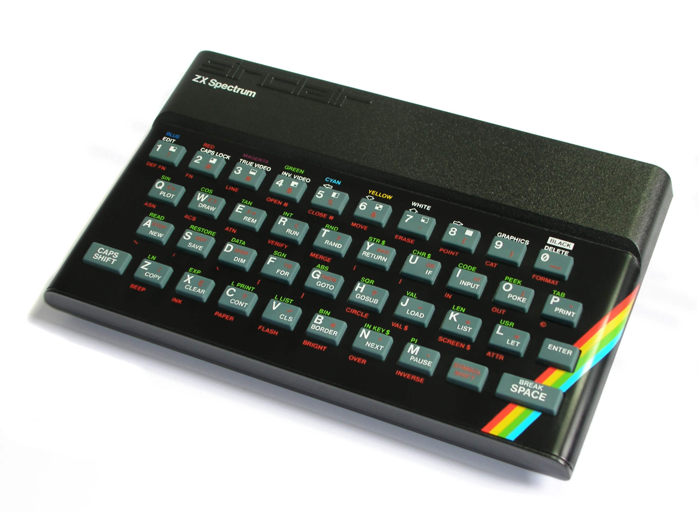

---
# ── Метадані ──────────────────────────────────────────────────────
# EN-переклад. Тіло — англійською; спільні поля збігаються з UA-версією
# (src/content/longreads/sinclair-price-of-a-television.md). Парування UA↔EN —
# за спільним slug (див. src/lib/longreads.ts).
slug: "sinclair-price-of-a-television"
block: "А"
card_id: "A1"
title:
  uk: "Як Sinclair зробив комп'ютер за ціною телевізора"
  en: "How Sinclair built a computer for the price of a television"
lead:
  uk: "У квітні 1982 року Sinclair показав машину, що коштувала £125 — удвічі дешевше за BBC Micro. Розбираємо, на чому саме заощадили, щоб домашній комп'ютер став доступним."
  en: "In April 1982 Sinclair unveiled a machine that cost £125 — half the price of the BBC Micro. We look at exactly where the savings came from that made a home computer affordable."
thesis:
  uk: "ZX Spectrum став масовим не завдяки потужності, а завдяки радикальному здешевленню: один замовний чип ULA замінив десятки мікросхем, а вивід на домашній телевізор прибрав потребу в окремому моніторі."
  en: "The ZX Spectrum went mainstream not through power but through radical cost-cutting: a single custom ULA chip replaced dozens of ICs, and output to a home television removed the need for a separate monitor."
confidence: "medium"
reading_time_min: 8
status: "approved"
authors: ["SNC Museum"]
published: "2026-07-24"

# ── SEO ───────────────────────────────────────────────────────────
seo:
  keywords_uk: ["історія ZX Spectrum", "Sinclair", "домашній комп'ютер 1982", "ціна ZX Spectrum", "ULA"]
  description_uk: "Чому ZX Spectrum 1982 року коштував £125 — дешевше за конкурентів. Роль чипа ULA, вивід на телевізор і економіка доступності."
  description_en: "Why the 1982 ZX Spectrum cost £125 — cheaper than its rivals. The role of the ULA chip, TV output and the economics of affordability."

# ── Блок «Експонат музею» ─────────────────────────────────────────
museum_exhibit:
  in_museum: true
  inventory_id: ""
  note_uk: "Базова 48-КБ модель у постійній експозиції — та сама машина, що зробила платформу масовою."

# ── Розмежувальні примітки ────────────────────────────────────────
disambiguation:
  - "£125 was the launch price of the 16K model; the 48K cost £175. Prices were later (1983) cut to £99 and £129 respectively — don't confuse the launch prices with the reduced ones."

# ── Джерела (ТЗ §12: ≥ 2) ─────────────────────────────────────────
sources:
  - title:
      uk: "ZX Spectrum — Wikipedia (англ.)"
      en: "ZX Spectrum — Wikipedia"
    url: "https://en.wikipedia.org/wiki/ZX_Spectrum"
    accessed: "2026-07-23"
    confidence: "high"
  - title:
      uk: "Sinclair ZX Spectrum 48K — Centre for Computing History"
      en: "Sinclair ZX Spectrum 48K — Centre for Computing History"
    url: "https://www.computinghistory.org.uk/det/424/sinclair-zx-spectrum-48k/"
    accessed: "2026-07-23"
    confidence: "high"
  - title:
      uk: "BBC Micro — Wikipedia (англ.)"
      en: "BBC Micro — Wikipedia"
    url: "https://en.wikipedia.org/wiki/BBC_Micro"
    accessed: "2026-07-23"
    confidence: "high"

# ── Зображення (ТЗ §7.2/§7.3: усі поля обов'язкові) ───────────────
images:
  - src: "zx-48k.jpg"
    alt:
      uk: "ZX Spectrum 48K із чорним клиноподібним корпусом і сірою гумовою клавіатурою, райдужна смуга праворуч від клавіш"
      en: "ZX Spectrum 48K with a black wedge case and grey rubber keyboard, rainbow stripe to the right of the keys"
    author: "Bill Bertram"
    license: "CC-BY-SA-2.5"
    source_url: "https://commons.wikimedia.org/wiki/File:ZXSpectrum48k.jpg"
    accessed: "2026-07-23"

# ── Заклик до дії ─────────────────────────────────────────────────
cta:
  type: "excursion"
  label_uk: "Записатися на екскурсію"
  # type: excursion завжди резолвиться у EXCURSION_URL (src/lib/longreads.ts).
  url: "https://sncmuseum.org/rozklad-ekskursiy"
---

<!-- ════════════ LONGREAD BODY (EN) ════════════
     Translation of the UA original. Every technical claim traces to sources[]. -->

## A computer with nothing left to buy

On 23 April 1982 Sinclair Research introduced the ZX Spectrum — a home computer that cost £125 in its basic 16 KB version and £175 in the 48 KB one. For comparison: the BBC Micro, the main British competitor of the same period, sold for £235 (Model A) and £335 (Model B). The Spectrum was almost half the price — and it was the price, not the specification, that made it the people's machine.

The title of this piece is a metaphor, but not far from the truth. The Spectrum was deliberately designed so that the buyer would not have to buy either a monitor or a disk drive on top: the computer plugged into an ordinary home television, and programs loaded from an ordinary cassette recorder. All the "peripherals" were already in the living room. The central claim of this material is simple: the Spectrum's affordability was not a market accident but the result of a series of engineering decisions, each with a single aim — to cut the cost.

*Bill Bertram · [CC BY-SA 2.5](https://creativecommons.org/licenses/by-sa/2.5/) · [Wikimedia Commons](https://commons.wikimedia.org/wiki/File:ZXSpectrum48k.jpg)*

## One chip instead of a pile of ICs: the ULA

The main decision that set the price was the ULA chip (Uncommitted Logic Array). This is a custom chip that Ferranti of Britain manufactured for Sinclair. The idea of the ULA is to take dozens of separate logic ICs that perform routine functions (generating the video signal, handling memory, scanning the keyboard) and "bake" them into a single die.

The effect is already visible in the Spectrum's predecessors: the ZX80 had 21 separate discrete-logic ICs (that is, a set of simple chips, each with its own function), whereas in the ZX81 the same functionality fitted into 4 chips — precisely thanks to the ULA. Every chip that is not on the board is not only money saved on the component itself, but also a simpler board, fewer solder joints, less waste on the production line and lower power consumption. In the Spectrum the ULA logic was designed by Richard Altwasser, and the industrial design of the case and keyboard by Rick Dickinson, who had earlier styled the ZX80 and ZX81.

The ULA technology was a trade-off for Sinclair too: a custom chip is harder to design and debug than assembling a circuit from off-the-shelf ICs, and Ferranti's first batches carried a noticeable defect rate. But once production reached volume, every subsequent die cost pennies — and the whole economics of assembly tilted in the ULA's favour. That is why the chip became not merely a part but the backbone of the entire pricing strategy: bringing the Spectrum down to £125 with separate ICs would have been impossible.

> **A shared lineage.** Sinclair worked out the "fold dozens of ICs into a single ULA" approach on the ZX81 and carried it over to the Spectrum. It is the same design logic that Soviet and Ukrainian clones would later reproduce — this time out of necessity, because of shortages — replacing the proprietary ULA with their own sets of discrete logic.

## A processor off the shelf, not made to order

The second decision was not to develop a proprietary processor but to take a ready-made one. The Spectrum uses a Zilog Z80A clocked at 3.5 MHz — a mass-produced, well-documented and, at the time, cheap processor for which a vast base of code and documentation already existed. This cut costs not only on the hardware but on development too: programmers did not have to learn a new architecture from scratch.

To the processor was added 16 KB of read-only memory (ROM) with the built-in Sinclair BASIC language and its interpreter. There was either 16 KB or 48 KB of RAM — and it was precisely the difference in RAM that produced the £50 gap between the two models. Everything else in them was the same.

## Television instead of a monitor, cassette instead of a disk

The third block of savings was on input/output devices. The Spectrum sent its picture to a domestic television through the aerial input: the buyer did not have to spend another £100+ on a separate monitor. Data storage was likewise shifted onto what was already at home — the cassette recorder. A program was "heard" as the characteristic screech of an audio signal; a disk drive, which would have cost as much as the computer itself, simply was not part of the basic package.

This strategy has a flip side, and it matters to the museum not to gloss over it: the rubber "membrane" keyboard, the limited palette with its characteristic colour clash (attribute clash), the slow cassette loading. All of these are direct consequences of the cost-cutting. But for the 1982 buyer the equation was obvious: for £125 they got a real programmable computer, not a toy.

> **What we're still checking.** We deliberately do not give an exact retail price for a colour television in Britain in 1982 — we do not yet have a single reliable source for that figure, so we keep the "price of a television" metaphor as an image rather than a precise number. If you have a document (a catalogue, an advertising leaflet, a receipt from those years) — send it to the museum and we will update the material.

## Price as a weapon: what happened next

The strategy worked. As early as 1983 Sinclair was able to cut prices further — to £99 for the 16 KB and £129 for the 48 KB version — finally cementing the Spectrum as Britain's best-selling home computer. Cheapness created a flywheel effect: the more machines were sold, the more games and programs were written; the larger the library, the more attractive the platform for the next buyer. Competitors who bet on a better keyboard or better graphics found themselves competing no longer with the Spectrum's specification but with its price and its accumulated library — and that is far harder.

For the museum there is a broader lesson here too: the Spectrum's story shows that a platform's fate is often decided not in the lab but in the accounts department. Technically superior machines lost to cheaper ones, because the home-computer market of the 1980s was above all a market of price.

This very economics of affordability would reach Ukraine a few years later — but in a different form. Where in Britain the price was driven down by a custom chip and mass production, in the post-Soviet space it was driven down by self-assembly, by discrete logic in place of the ULA, and by swapping cassettes at radio markets. More on that in the coming materials in the block on clones.

## The museum exhibit

The museum's permanent display holds a basic 48 KB ZX Spectrum — the very machine that made the platform mainstream. On it you can see all the decisions discussed above: Rick Dickinson's wedge case, the rubber keyboard, the aerial output to a television and — under the lid — a compact board with a single ULA chip in place of dozens of separate ICs.

<!-- TODO photo-documentation: macro of the 48K board with the ULA highlighted; general view of the machine in the display case. Add to images[] with license: museum-own after the shoot. -->
